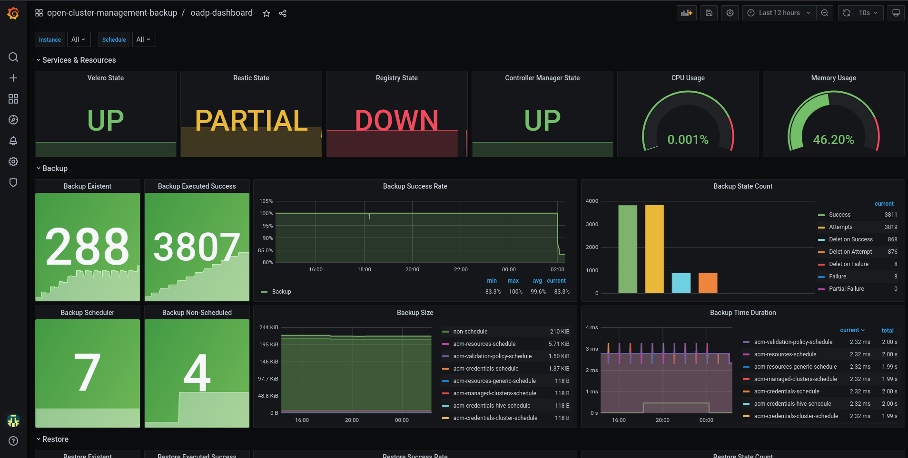

# Openshift API Data Protection - Dashboard


- To install this dashboard on Grafana Operator

```shell
cat << EOF > grafana-dashboard.yaml
apiVersion: integreatly.org/v1alpha1
kind: GrafanaDashboard
metadata: 
  name: grafana-dashboard-oadp
  labels: 
    app: grafana
spec:
  customFolderName: "open-cluster-management-backup"      
  url: https://raw.githubusercontent.com/leoaaraujo/oadp-dashboard/main/files/oadp-dash.json
EOF
```


&nbsp;


